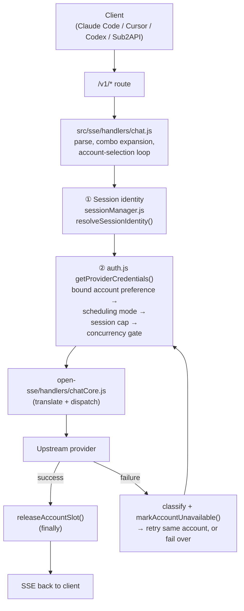
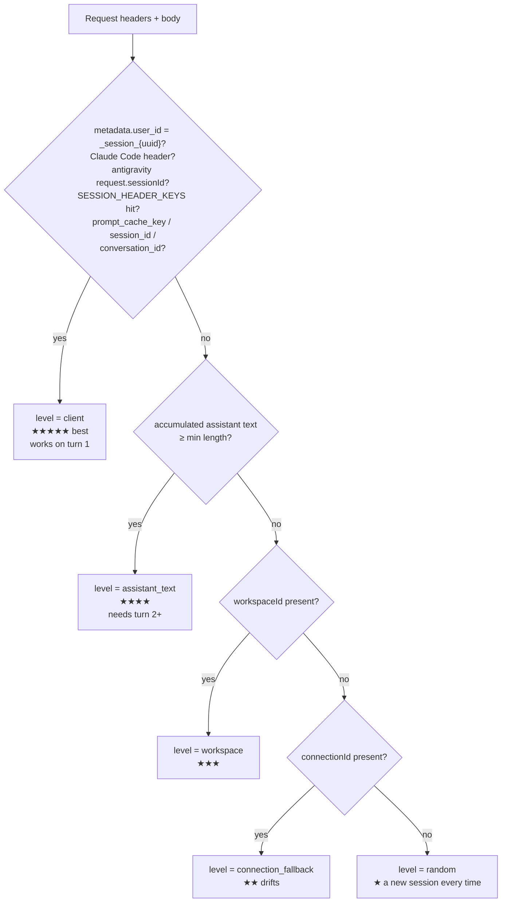
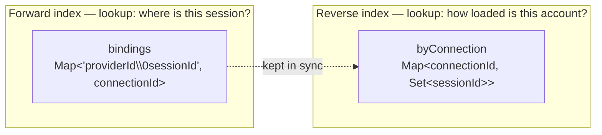
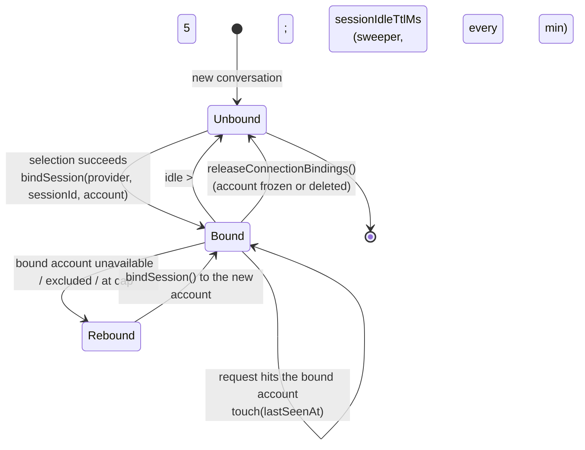
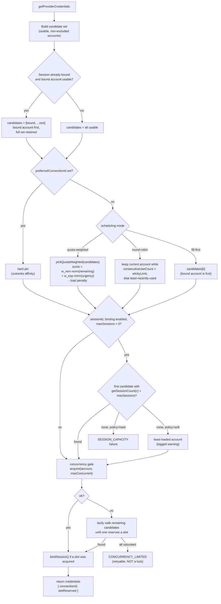
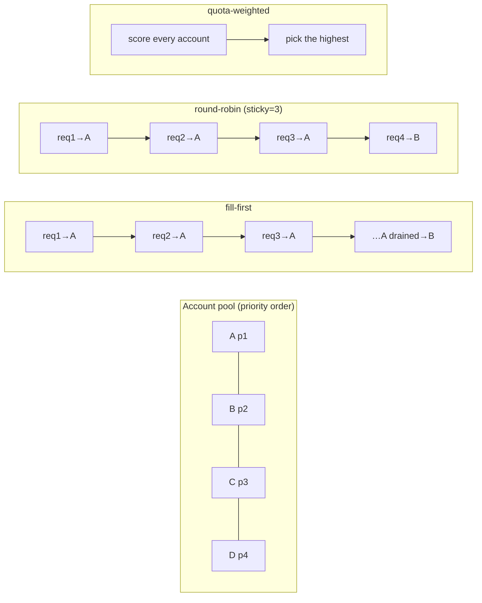
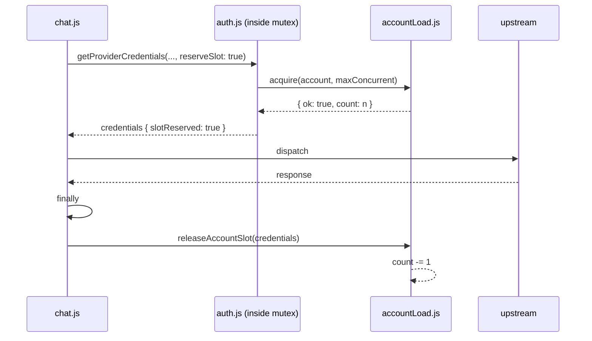
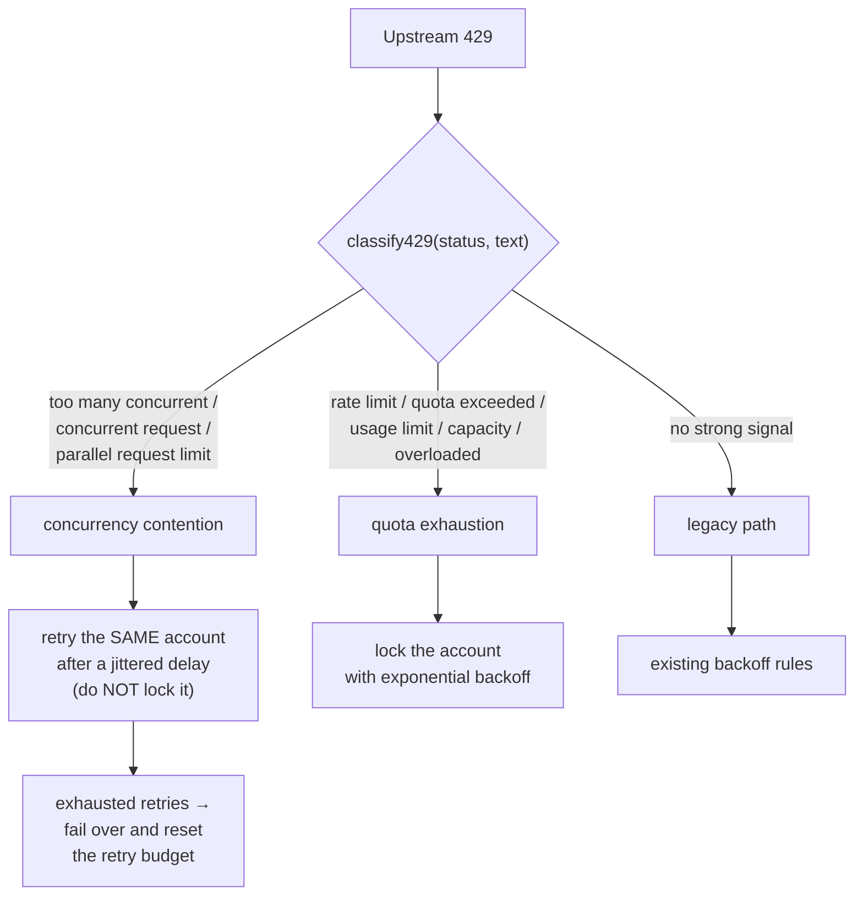

# 9Router Scheduling & Session Affinity

_Last updated: 2026-09-14_

> 中文版见 [`SCHEDULING.zh-CN.md`](./SCHEDULING.zh-CN.md)

## Executive Summary

9Router picks **one upstream account per request** out of every usable account for a
provider. How it picks is the *scheduling* concern; this document describes that
selection pipeline end to end.

The pipeline has three layers:

1. **Session identity** — work out whether this request belongs to a conversation we
   have already seen (`open-sse/utils/sessionManager.js`).
2. **Session → account binding** — if it does, keep it on the same account so the
   provider-side **prompt cache stays warm** (`open-sse/services/sessionBindings.js`).
3. **Scheduler + concurrency gate** — order candidates, apply the scheduling mode,
   enforce the per-account session cap, and atomically reserve a concurrency slot
   (`src/sse/services/auth.js`, `open-sse/services/accountLoad.js`).

The whole point of this design is to **stop naive round-robin from destroying prompt
cache** while still keeping several accounts busy. Round-robin cycles accounts per
request, so a multi-turn conversation re-prefills its entire context on a different
account every turn. Session affinity pins a conversation to one account instead.

---

## 1. Where it sits in the request flow



The account-selection loop lives in `handleSingleModelChat()`. It calls
`getProviderCredentials()` repeatedly with a growing `excludeConnectionIds` set until
an account answers or every account is exhausted.

---

## 2. Layer 1 — Session identity

`resolveSessionIdentity()` resolves a **stable per-conversation id** through five
levels, best first. The level actually used is reported back on the identity object
and is what the read-only probe measures.



### Level reference

| Level | Signal | Stability | Available from |
|---|---|---|---|
| `client` | Client-supplied session id (body field or header) | ★★★★★ | Turn 1 |
| `assistant_text` | `sha256` of accumulated assistant replies | ★★★★ | Turn 2+ |
| `workspace` | Workspace / project identifier | ★★★ | Turn 1 |
| `connection_fallback` | Derived from the connection id | ★★ (drifts) | Turn 1 |
| `random` | Generated id | ★ | — |

**`assistant_text` cannot cover a conversation's first turn** because there is no
assistant reply yet to hash. Those requests fall to `random` and therefore cannot be
pinned. This is the single biggest limitation when the client sends no session id.

> The resolver is deliberately reused as-is — no second fingerprinting scheme is
> introduced on top of it.

---

## 3. Layer 2 — Session → account binding

### Data model



Two indexes because the two lookups are hot and go in opposite directions:

- **selection** needs *"which account is this conversation on?"*
- **the session cap** needs *"how many conversations is this account holding?"*

Bindings are **in-process only**. Losing them at restart costs exactly one cache miss,
which is cheaper than a DB write on the hot path.

### Binding lifecycle



On **rebind** the old account's set entry is removed, and if that account has neither
sessions nor in-flight load left, its load counter is drained so a stale
`acquire()` cannot permanently block it.

---

## 4. Layer 3 — Selection pipeline

Everything below happens **inside a per-provider mutex**
(`acquireSelectionMutex`) so two concurrent selectors cannot both see a free slot and
both take it (the original TOCTOU). The mutex is sharded per provider so a slow
provider cannot head-of-line-block unrelated providers.



### Why the bound account is a *preference*, not the whole set

An earlier revision collapsed `candidates` to `[bound]`. That made a busy bound
account unrescuable: the concurrency walk had no alternative to fall back to, so the
request returned `503 concurrent request limit reached` **even while every other
account was idle**. Keeping the bound account first while retaining the rest means
affinity is honoured whenever possible and only sacrificed for availability.

---

## 5. Scheduling modes



| Mode | Rule | Best for | Main downside |
|---|---|---|---|
| `fill-first` | Take `candidates[0]`; drain it, then move on | Default. Fewest accounts touched → best prompt-cache locality | A small soon-expiring package can be left unused |
| `round-robin` | Stay on the current account for `stickyRoundRobinLimit` calls, then rotate | Perfectly even load | **Scatters prompt cache** — every rotation re-prefills the context |
| `quota-weighted` | Score all candidates and take the best | Burning soon-to-expire balances before they are wasted | Needs quota snapshots; degrades to neutral scores without them |

### Quota-weighted scoring

The two axes have **different units** (points / percent vs milliseconds), so applying
weights to the raw values would be dimensionally wrong. Each axis is min-max
normalised across the *current* candidate set into `[0,1]` first:

```
score = wRemaining · norm(remaining) + wExpiry · norm(expiryUrgency) − loadPenalty
```

- `norm(remaining)` — higher remaining quota scores higher.
- `norm(expiryUrgency)` — `resetAtMs` is negated before normalising, so a **sooner**
  expiry yields a **higher** urgency value. With `preferEarlierExpiry = false` the
  value is inverted, preferring the account with more runway.
- Accounts with **no quota data score neutral (0.5 / 0.5)** — neither starved nor
  unfairly preferred.
- The load penalty is bounded below one weight unit, so it only breaks ties.

### Optimistic discount (anti-stampede)

Quota snapshots are stale by nature. If N concurrent selectors score against the same
snapshot they all pick the same "best" account, re-creating the thundering herd. Each
selection therefore records a short-lived local decrement (30 s TTL) that
`withOptimisticDiscount()` subtracts from the apparent remaining quota, so the next
selector within the window sees a less attractive account and spreads out.

---

## 6. Concurrency gate

`accountLoad.js` is a tiny in-process `Map<connectionId, count>`.



**Reservation must be released by the caller.** This is enforced by making it
explicitly opt-in:

```js
const reserveSlot = options?.reserveSlot === true;
```

Only callers that actually release (currently `chat.js`, in a `try/finally`) reserve.
Every other caller would otherwise acquire a slot it never returns, leaking the
counter until **every** account looks saturated and the gate starts rejecting healthy
traffic.

`releaseAccountSlot()` is guarded by `credentials.slotReserved`, so a double release is
a no-op.

---

## 7. Failure handling

### 429 classification

Not all 429s mean the same thing, and treating them alike throws away good accounts.



A concurrency-429 means **the account is healthy** — it is simply serving too many
parallel requests. Locking it for minutes is exactly the wrong response, and it is
the failure mode that appears once session affinity concentrates traffic.

### Retry loop summary

| Outcome | Action |
|---|---|
| Success | Release slot, return response |
| Concurrency-429 | Retry the same account up to `CONCURRENCY_RETRY_MAX` (3), jittered |
| Concurrency-429, retries exhausted | Release, exclude account, reset retry budget, continue |
| Quota-429 / auth / 5xx | Release, exclude account, continue |
| All accounts saturated | `CONCURRENCY_LIMITED` (retryable) |
| All accounts at session cap, policy=hard | `SESSION_CAPACITY` |
| No accounts at all | 404 / 503 with the last error |

---

## 8. Observability

### Diagnostic endpoint

`GET /api/diagnostics/scheduling` returns the effective settings plus three live
snapshots:

| Block | Source | Answers |
|---|---|---|
| `settings` | settings repo | What is actually in effect right now? |
| `sessionProbe` | `sessionProbe.js` | How is session identity being resolved, and how stable are the candidate keys? |
| `accountLoad` | `accountLoad.js` | In-flight requests per account |
| `sessionBindings` | `sessionBindings.js` | Bound sessions per account |

Control actions via `POST` with `{ "action": ... }`:
`enable-probe`, `disable-probe`, `reset-load`.

### Dashboard

`/dashboard/scheduling` visualises the same data: identity-level distribution,
candidate recurrence rates, per-account load and bound-session counts, and the
effective settings.

### Read-only probe

The probe records **which identity level matched** and whether alternative candidate
keys would have stayed stable in a rolling window. It makes **zero routing
decisions**. Enable with `SESSION_PROBE=1` (or the runtime toggle). Every exported
function is a cheap no-op while disabled.

### Health checklist

| Signal | Healthy | Unhealthy |
|---|---|---|
| `accountLoad` account count | single digits | grows toward the total account count |
| Accounts at `maxConcurrentPerAccount` | 0 | all of them |
| Max sessions on one account | `≤ maxSessionsPerAccount` | far above the cap |
| `sessionProbe.levelHits.random` | low | high (client sends no session id) |

---

## 9. Settings reference

| Key | Default | Effect |
|---|---|---|
| `schedulingMode` | `fill-first` | `fill-first` \| `round-robin` \| `quota-weighted` |
| `sessionBindingEnabled` | `true` | Master switch for session → account affinity |
| `maxSessionsPerAccount` | `3` | Session cap per account (`0` = unlimited) |
| `sessionOverflowPolicy` | `soft` | `soft` = overflow onto the least-loaded account; `hard` = fail |
| `sessionIdleTtlMs` | `1800000` (30 min) | Idle time before a binding is released |
| `sessionBindingSweepIntervalMs` | `300000` (5 min) | Sweeper period |
| `maxConcurrentPerAccount` | `0` | In-flight ceiling per account (`0` = unlimited) |
| `quotaPreferEarlierExpiry` | `true` | Prefer accounts whose balance expires sooner |
| `quotaWeightRemaining` | `1.0` | Weight of remaining quota in the score |
| `quotaWeightExpiry` | `0.5` | Weight of expiry urgency in the score |
| `sessionProbeEnabled` | `false` | Runtime probe toggle |

All of these can be overridden per provider via `providerStrategies[provider]`.

> If `sessionProbeEnabled` is set in the dashboard, note that it is a **runtime
> override**. After a process restart the probe falls back to the `SESSION_PROBE`
> environment variable. Set `SESSION_PROBE=1` to have it on by default.

---

## 10. Module map

| File | Responsibility |
|---|---|
| `open-sse/utils/sessionManager.js` | `resolveSessionIdentity()` — 5-level session resolver; `captureSessionIdentity()` |
| `open-sse/services/sessionBindings.js` | Session → account binding store, idle sweeper, move/drain semantics |
| `open-sse/services/accountLoad.js` | Per-account in-flight counter (`acquire` / `release` / `snapshotLoad`) |
| `open-sse/services/quotaScheduler.js` | Normalised quota scoring, `pickQuotaWeighted()`, optimistic discount |
| `open-sse/utils/sessionProbe.js` | Read-only identity probe and periodic report |
| `open-sse/config/errorConfig.js` | `classify429()`, retry timing, backoff rules |
| `open-sse/services/accountFallback.js` | Error → verdict, concurrency-429 short-circuit, retry delay |
| `src/sse/services/auth.js` | `getProviderCredentials()` — the selection pipeline; mutex sharding; `releaseAccountSlot()` |
| `src/sse/handlers/chat.js` | Retry loop, slot lifecycle orchestration, probe call |
| `src/app/api/diagnostics/scheduling/route.js` | Diagnostic API |
| `src/app/(dashboard)/dashboard/scheduling/page.js` | Diagnostics dashboard |
| `src/lib/db/repos/settingsRepo.js` | Defaults for the settings above |
