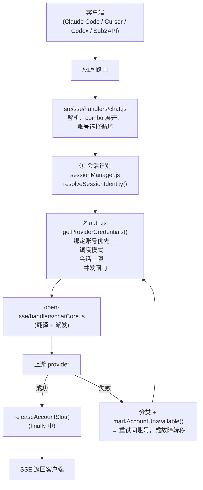
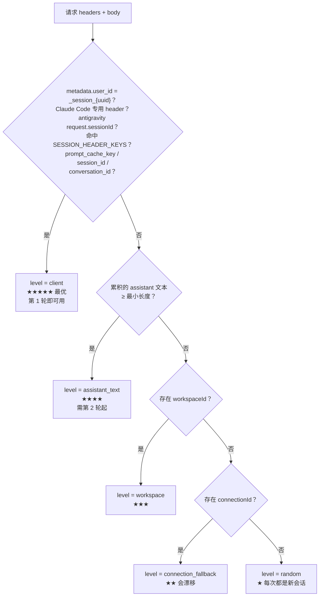
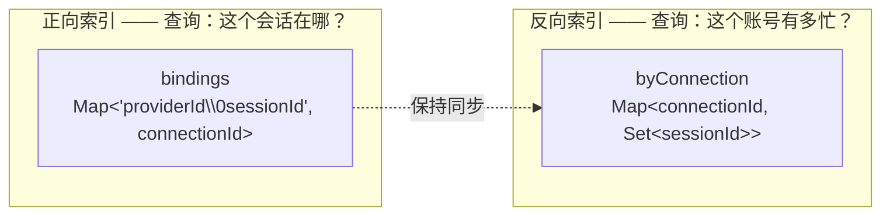
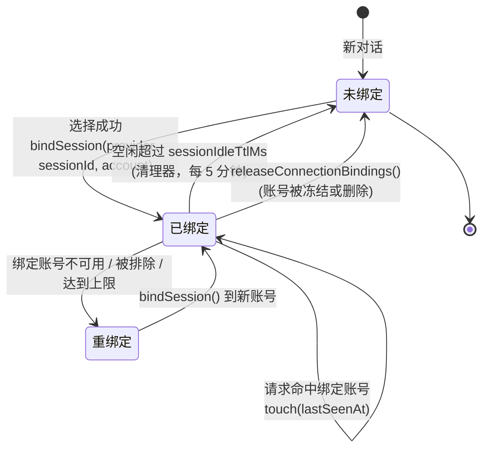
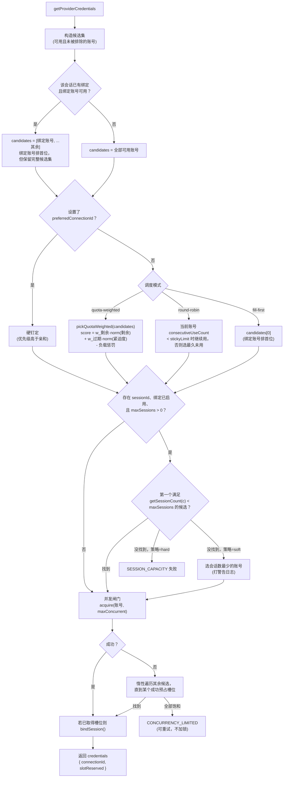
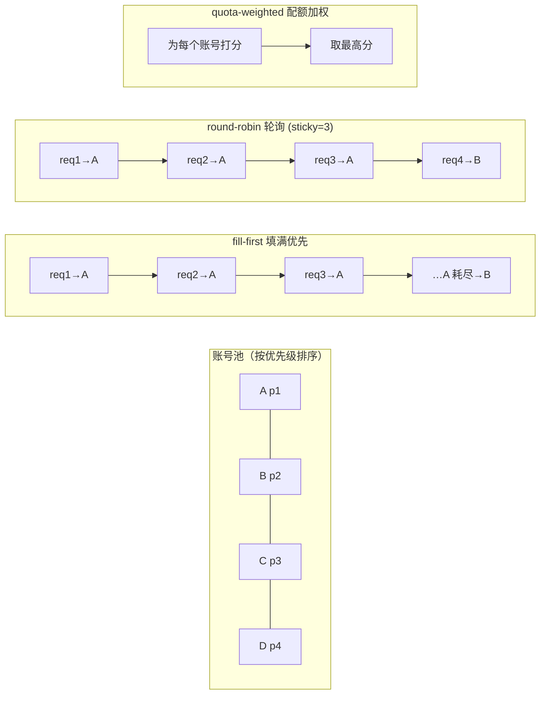
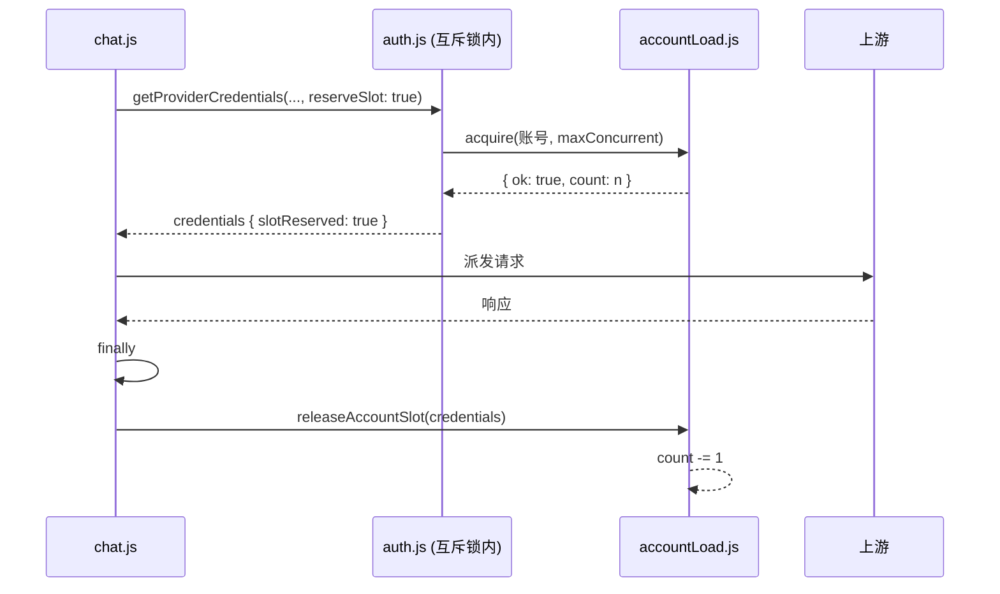
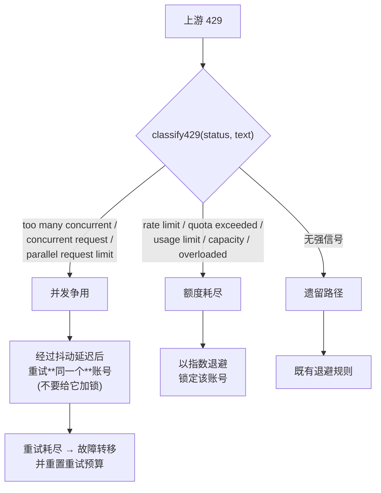

# 9Router 调度与会话亲和

_最后更新：2026-09-14_

> 英文版见 [`SCHEDULING.md`](./SCHEDULING.md)

## 概述

9Router 为**每个请求**在某个 provider 的全部可用账号中选择**一个上游账号**。如何选择就是「调度」问题，本文档完整描述这条选择流水线。

整条流水线分为三层：

1. **会话识别** —— 判断这个请求是否属于我们已经见过的某个对话（`open-sse/utils/sessionManager.js`）。
2. **会话 → 账号绑定** —— 如果是，则让它继续使用同一账号，从而让上游侧的 **prompt cache 保持命中**（`open-sse/services/sessionBindings.js`）。
3. **调度器 + 并发闸门** —— 对候选账号排序、应用调度模式、执行每账号会话上限、并原子地预占一个并发槽位（`src/sse/services/auth.js`、`open-sse/services/accountLoad.js`）。

这套设计的核心目的，是**阻止朴素的轮询（round-robin）破坏 prompt cache**，同时仍然让多个账号保持忙碌。轮询会为每个请求切换账号，因此一个多轮对话每一轮都会在**另一个账号**上重新预填充（prefill）全部上下文。会话亲和则把一个对话钉死在同一个账号上。

---

## 1. 在请求流中的位置



账号选择循环位于 `handleSingleModelChat()`。它会带着不断增长的 `excludeConnectionIds` 集合反复调用 `getProviderCredentials()`，直到某个账号成功应答或所有账号都被排除。

---

## 2. 第一层 —— 会话识别

`resolveSessionIdentity()` 通过五个层级解析出**稳定的每对话 id**，从最优到最差。实际命中的层级会通过 identity 对象返回，也是只读探针所统计的内容。



### 层级说明

| 层级 | 信号来源 | 稳定性 | 何时可用 |
|---|---|---|---|
| `client` | 客户端传入的会话 id（body 字段或 header） | ★★★★★ | 第 1 轮 |
| `assistant_text` | 累积的助手回复文本的 `sha256` | ★★★★ | 第 2 轮起 |
| `workspace` | 工作区 / 项目标识 | ★★★ | 第 1 轮 |
| `connection_fallback` | 由 connection id 派生 | ★★（会漂移） | 第 1 轮 |
| `random` | 随机生成 | ★ | — |

**`assistant_text` 无法覆盖对话的第一轮**，因为此时还没有助手回复可供哈希。这类请求会落到 `random`，因而无法被固定到某个账号。当客户端不传会话 id 时，这是最大的局限。

> 该解析器被刻意**原样复用**——没有在其之上再造第二套指纹方案。

---

## 3. 第二层 —— 会话到账号的绑定

### 数据模型



之所以要两个索引，是因为两种查询都是热点且方向相反：

- **选择账号**需要知道：*「这个对话在哪个账号上？」*
- **会话上限检查**需要知道：*「这个账号持有了多少个对话？」*

绑定**仅存在于进程内存中**。进程重启时丢失绑定，代价仅仅是一次缓存未命中，这比在热路径上写数据库要划算。

### 绑定生命周期



在**重绑定**时，会从旧账号的集合中移除该条目；若旧账号既无会话也无在途负载，则清空它的负载计数，避免残留的 `acquire()` 永久阻塞该账号。

---

## 4. 第三层 —— 选择流水线

以下全部发生在**每 provider 的互斥锁**（`acquireSelectionMutex`）之内，这样两个并发选择器不会同时看到空闲槽位、又同时抢占（即最初存在的 TOCTOU 问题）。互斥锁按 provider 分片，因此某个慢 provider 不会阻塞无关的 provider。



### 为什么绑定账号是**偏好**而非全部候选

早期版本曾把 `candidates` 收窄为 `[bound]`。这让一个繁忙的绑定账号变得无从解救：并发闸门的转移逻辑没有任何备选项可退，于是请求会返回 `503 concurrent request limit reached`，**即使其余所有账号都空闲**。现在把绑定账号排在首位但保留其余候选，意味着亲和性在可能时被满足，只在为保可用性时才被牺牲。

---

## 5. 调度模式



| 模式 | 规则 | 适用场景 | 主要缺点 |
|---|---|---|---|
| `fill-first` | 取 `candidates[0]`；耗尽后再换下一个 | 默认。触及账号数最少 → prompt cache 局部性最好 | 快过期的小额度包可能被剩下不用 |
| `round-robin` | 在 `stickyRoundRobinLimit` 次调用内保持当前账号，然后轮换 | 负载绝对均匀 | **打散 prompt cache** —— 每次轮换都会重新预填充上下文 |
| `quota-weighted` | 为所有候选打分，取最优 | 在额度包作废前优先烧完 | 依赖配额快照；没有数据时退化为中性分 |

### 配额加权评分

两个维度的**量纲不同**（积分 / 百分比 vs 毫秒），直接把权重作用在原始值上是量纲错误的。因此先对**当前候选集**做 min-max 归一化到 `[0,1]`：

```
score = w_剩余 · norm(剩余) + w_过期 · norm(过期紧迫度) − 负载惩罚
```

- `norm(剩余)` —— 剩余额度越高，得分越高。
- `norm(过期紧迫度)` —— 归一化前先对 `resetAtMs` 取负，因此**越早过期**得到的紧迫度值**越高**。当 `preferEarlierExpiry = false` 时该值被反转，转而偏好余量更充裕的账号。
- **没有配额数据**的账号得中性分（0.5 / 0.5）—— 既不会被饿死，也不会被不公平地偏好。
- 负载惩罚被限制在一个权重单位以内，因此只用于打破平局。

### 乐观扣减（防踩踏）

配额快照天然是陈旧的。如果 N 个并发选择器都基于同一份快照打分，它们会全部选中同一个"最优"账号，从而重新制造惊群问题。因此每次选择都会记录一个短时效的本地扣减（TTL 30 秒），`withOptimisticDiscount()` 会从可见剩余额度中减去它，使得窗口内的下一个选择器看到一个不那么有吸引力的账号，从而把流量摊开。

---

## 6. 并发闸门

`accountLoad.js` 是一个极简的进程内 `Map<connectionId, count>`。



**预占必须由调用方释放。** 这一点通过把预占改为**显式 opt-in** 来保证：

```js
const reserveSlot = options?.reserveSlot === true;
```

只有真正会释放的调用方（目前是 `chat.js`，在 `try/finally` 中）才会预占。否则其它调用方会占用一个永不归还的槽位，让计数持续泄漏，直到**每个**账号看起来都饱和，闸门开始拒绝健康流量。

`releaseAccountSlot()` 由 `credentials.slotReserved` 守卫，因此重复释放是无副作用的空操作。

---

## 7. 失败处理

### 429 分类

并非所有 429 含义相同，把它们一视同仁会白白丢弃健康的账号。



并发型 429 意味着**该账号是健康的**——它只是当前并行请求过多。把它锁上几分钟恰恰是错误响应，而这正是会话亲和把流量集中之后会出现的故障模式。

### 重试循环一览

| 结果 | 动作 |
|---|---|
| 成功 | 释放槽位，返回响应 |
| 并发型 429 | 同一账号最多重试 `CONCURRENCY_RETRY_MAX`（3）次，带抖动 |
| 并发型 429，重试耗尽 | 释放、排除该账号、重置重试预算、继续 |
| 额度型 429 / 鉴权失败 / 5xx | 释放、排除该账号、继续 |
| 所有账号饱和 | `CONCURRENCY_LIMITED`（可重试） |
| 所有账号达会话上限，策略=hard | `SESSION_CAPACITY` |
| 完全没有账号 | 404 / 503，附带最后一次错误 |

---

## 8. 可观测性

### 诊断接口

`GET /api/diagnostics/scheduling` 返回当前生效的设置，以及三份实时快照：

| 数据块 | 来源 | 回答的问题 |
|---|---|---|
| `settings` | settings 仓库 | 当前实际生效的配置是什么？ |
| `sessionProbe` | `sessionProbe.js` | 会话识别如何解析，候选键的稳定性如何？ |
| `accountLoad` | `accountLoad.js` | 每个账号的在途请求数 |
| `sessionBindings` | `sessionBindings.js` | 每个账号绑定的会话数 |

通过 `POST` 并携带 `{ "action": ... }` 执行控制动作：
`enable-probe`、`disable-probe`、`reset-load`。

### 面板

`/dashboard/scheduling` 将同一份数据可视化：识别层级分布、候选键复现率、每账号负载与绑定会话数，以及当前生效的设置。

### 只读探针

探针记录**命中了哪个识别层级**，以及备选候选键在滚动窗口内是否保持稳定。它**不做任何路由决策**。可通过 `SESSION_PROBE=1`（或运行时开关）启用。禁用时所有导出函数都是极廉价的空操作。

### 健康检查清单

| 信号 | 健康 | 异常 |
|---|---|---|
| `accountLoad` 的账号数 | 个位数 | 增长到接近账号总数 |
| 达到 `maxConcurrentPerAccount` 的账号数 | 0 | 全部 |
| 单账号最大绑定会话数 | `≤ maxSessionsPerAccount` | 远超上限 |
| `sessionProbe.levelHits.random` | 低 | 高（客户端未传会话 id） |

---

## 9. 设置参考

| 配置项 | 默认值 | 作用 |
|---|---|---|
| `schedulingMode` | `fill-first` | `fill-first` \| `round-robin` \| `quota-weighted` |
| `sessionBindingEnabled` | `true` | 会话 → 账号亲和的开关 |
| `maxSessionsPerAccount` | `3` | 每账号会话上限（`0` = 不限） |
| `sessionOverflowPolicy` | `soft` | `soft` = 溢出到会话数最少的账号；`hard` = 直接失败 |
| `sessionIdleTtlMs` | `1800000`（30 分钟） | 绑定空闲多久后被释放 |
| `sessionBindingSweepIntervalMs` | `300000`（5 分钟） | 清理器周期 |
| `maxConcurrentPerAccount` | `0` | 每账号在途请求上限（`0` = 不限） |
| `quotaPreferEarlierExpiry` | `true` | 优先选择额度更早过期的账号 |
| `quotaWeightRemaining` | `1.0` | 剩余额度在评分中的权重 |
| `quotaWeightExpiry` | `0.5` | 过期紧迫度在评分中的权重 |
| `sessionProbeEnabled` | `false` | 运行时探针开关 |

以上全部可通过 `providerStrategies[provider]` 按 provider 覆盖。

> 需要注意：在面板中设置 `sessionProbeEnabled` 属于**运行时覆盖**。进程重启后探针会回退到 `SESSION_PROBE` 环境变量。若希望默认开启，请设置 `SESSION_PROBE=1`。

---

## 10. 模块索引

| 文件 | 职责 |
|---|---|
| `open-sse/utils/sessionManager.js` | `resolveSessionIdentity()` —— 5 级会话解析器；`captureSessionIdentity()` |
| `open-sse/services/sessionBindings.js` | 会话 → 账号绑定存储、空闲清理器、迁移与清空语义 |
| `open-sse/services/accountLoad.js` | 每账号在途计数器（`acquire` / `release` / `snapshotLoad`） |
| `open-sse/services/quotaScheduler.js` | 归一化配额评分、`pickQuotaWeighted()`、乐观扣减 |
| `open-sse/utils/sessionProbe.js` | 只读识别探针与周期性报告 |
| `open-sse/config/errorConfig.js` | `classify429()`、重试时序、退避规则 |
| `open-sse/services/accountFallback.js` | 错误 → 判定、并发型 429 短路、重试延迟 |
| `src/sse/services/auth.js` | `getProviderCredentials()` —— 选择流水线；互斥锁分片；`releaseAccountSlot()` |
| `src/sse/handlers/chat.js` | 重试循环、槽位生命周期编排、探针调用 |
| `src/app/api/diagnostics/scheduling/route.js` | 诊断 API |
| `src/app/(dashboard)/dashboard/scheduling/page.js` | 诊断面板 |
| `src/lib/db/repos/settingsRepo.js` | 上述配置项的默认值 |
